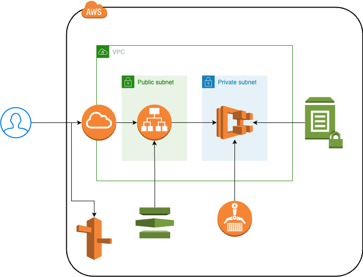

# Deployment 

Create AWS environment using AWS CDK.

## Overall



### Description

* Use ALB
* Use Fargate on ECS as a container runtime
* Use ECR as a container registry
* Use SSL certification with ACM
* Use parameter store to store credentials
* Use Route53 to set alias of ALB

## Requirements

* awscli
* docker

## Preparation

### Precondition

* Have a AWS Account
  * Create a SES Identity
* Have a own domain name
* Already created a certification of ACM
* Create a SendGrid's account

### Enable AWS account
If your profile is not `default`, you should execute the below command.

```bash
export AWS_PROFILE=[your profile name]
```

### Get authorization from repository

```bash
aws ecr get-login-password --region [your region] | docker login --username AWS --password-stdin [your aws account].dkr.ecr.[your region].amazonaws.com
```

### Create ECR repository

```bash
aws ecr create-repository --repository-name [your repository name]
```

### Build a app image

```bash
docker build -t [your repository uri]:[tag] .
```

and push

```bash
docker build -t [your repository uri]:[tag] .
```

### Create `.env`

Crete `.env` file by copying from `.env.example`.
And then, fill out the below items.

* deploy

| Item | Description |
| ---- | ---- |
| `CIDR_BLOCK` | A CIDR block of a new VPC |
| `VPC_NAME` | A name of a new VPC |
| `CLUSTER_NAME` | a name of a new ECS cluster |
| `CLUSTER_IMAGE_REPOSITORY_NAME` | The ECR repository name used by ECS |
| `CLUSTER_IMAGE_TAG` | A image tag of image used by ECS |
| `LOAD_BALANCER_DOMAIN_NAME` | The load balancer name to connect |
| `LOAD_BALANCER_CERTIFICATE_ARN` | The ARN of certification used by ALB |
| `ROUTE53_DOMAIN_NAME` | The hostzoned name |

* application

| Item | Description |
| ---- | ---- |
| `APP_GIN_MODE` | The mode of GIN |
| `APP_AWS_ACCESS_KEY_ID` | A `AWS_ACCESS_KEY_ID` used by app |
| `APP_AWS_SECRET_KEY` | A `AWS_SECRET_KEY` used by app |
| `APP_AWS_SES_ENDPOINT` | A `AWS_SES_ENDPOINT` used by app |
| `APP_AWS_REGION` | A `AWS_REGION` used by app |
| `APP_SENDGRID_API_KEY` | A `SENDGRID_API_KEY` used by app |


## Initialize CDK

```bash
cdk bootstrap
```

## Confirm CDK

```bash
cdk diff
```

## Execute CDK

```bash
cdk deploy
```
